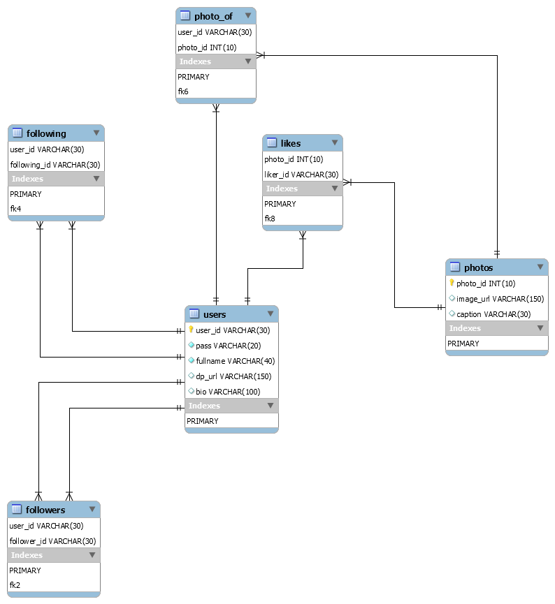

# MySQL Instuctions

 
 
 <br/>
 
 ```sql
-- -----------------------------------------------------
-- Schema insta
-- -----------------------------------------------------
CREATE SCHEMA IF NOT EXISTS `insta` DEFAULT CHARACTER SET utf8mb4 COLLATE utf8mb4_0900_ai_ci ;
USE `insta` ;

-- -----------------------------------------------------
-- Table `insta`.`users`
-- -----------------------------------------------------
CREATE TABLE IF NOT EXISTS `insta`.`users` (
  `user_id` VARCHAR(20) NOT NULL,
  `pass` VARCHAR(20) NOT NULL,
  `fullname` VARCHAR(40) NOT NULL,
  `dp_url` VARCHAR(150) NULL DEFAULT NULL,
  `bio` VARCHAR(100) NULL DEFAULT NULL,
  PRIMARY KEY (`user_id`))
ENGINE = InnoDB
DEFAULT CHARACTER SET = utf8mb4
COLLATE = utf8mb4_0900_ai_ci;


-- -----------------------------------------------------
-- Table `insta`.`followers`
-- -----------------------------------------------------
CREATE TABLE IF NOT EXISTS `insta`.`followers` (
  `user_id` VARCHAR(30) NOT NULL,
  `follower_id` VARCHAR(30) NOT NULL,
  PRIMARY KEY (`user_id`, `follower_id`),
  INDEX `fk2` (`follower_id` ASC) VISIBLE,
  CONSTRAINT `fk1`
    FOREIGN KEY (`user_id`)
    REFERENCES `insta`.`users` (`user_id`)
    ON DELETE CASCADE,
  CONSTRAINT `fk2`
    FOREIGN KEY (`follower_id`)
    REFERENCES `insta`.`users` (`user_id`)
    ON DELETE CASCADE)
ENGINE = InnoDB
DEFAULT CHARACTER SET = utf8mb4
COLLATE = utf8mb4_0900_ai_ci;


-- -----------------------------------------------------
-- Table `insta`.`following`
-- -----------------------------------------------------
CREATE TABLE IF NOT EXISTS `insta`.`following` (
  `user_id` VARCHAR(30) NOT NULL,
  `following_id` VARCHAR(30) NOT NULL,
  PRIMARY KEY (`user_id`, `following_id`),
  INDEX `fk4` (`following_id` ASC) VISIBLE,
  CONSTRAINT `fk3`
    FOREIGN KEY (`user_id`)
    REFERENCES `insta`.`users` (`user_id`)
    ON DELETE CASCADE,
  CONSTRAINT `fk4`
    FOREIGN KEY (`following_id`)
    REFERENCES `insta`.`users` (`user_id`)
    ON DELETE CASCADE)
ENGINE = InnoDB
DEFAULT CHARACTER SET = utf8mb4
COLLATE = utf8mb4_0900_ai_ci;


-- -----------------------------------------------------
-- Table `insta`.`photos`
-- -----------------------------------------------------
CREATE TABLE IF NOT EXISTS `insta`.`photos` (
  `photo_id` INT(10) UNSIGNED NOT NULL AUTO_INCREMENT,
  `image_url` VARCHAR(150) NULL DEFAULT NULL,
  `caption` VARCHAR(30) NULL DEFAULT NULL,
  PRIMARY KEY (`photo_id`))
ENGINE = InnoDB
AUTO_INCREMENT = 38
DEFAULT CHARACTER SET = utf8mb4
COLLATE = utf8mb4_0900_ai_ci;


-- -----------------------------------------------------
-- Table `insta`.`likes`
-- -----------------------------------------------------
CREATE TABLE IF NOT EXISTS `insta`.`likes` (
  `photo_id` INT(10) UNSIGNED NOT NULL,
  `liker_id` VARCHAR(30) NOT NULL,
  PRIMARY KEY (`photo_id`, `liker_id`),
  INDEX `fk8` (`liker_id` ASC) VISIBLE,
  CONSTRAINT `fk7`
    FOREIGN KEY (`photo_id`)
    REFERENCES `insta`.`photos` (`photo_id`)
    ON DELETE CASCADE,
  CONSTRAINT `fk8`
    FOREIGN KEY (`liker_id`)
    REFERENCES `insta`.`users` (`user_id`)
    ON DELETE CASCADE)
ENGINE = InnoDB
DEFAULT CHARACTER SET = utf8mb4
COLLATE = utf8mb4_0900_ai_ci;


-- -----------------------------------------------------
-- Table `insta`.`photo_of`
-- -----------------------------------------------------
CREATE TABLE IF NOT EXISTS `insta`.`photo_of` (
  `user_id` VARCHAR(30) NOT NULL,
  `photo_id` INT(10) UNSIGNED NOT NULL,
  PRIMARY KEY (`user_id`, `photo_id`),
  INDEX `fk6` (`photo_id` ASC) VISIBLE,
  CONSTRAINT `fk5`
    FOREIGN KEY (`user_id`)
    REFERENCES `insta`.`users` (`user_id`)
    ON DELETE CASCADE,
  CONSTRAINT `fk6`
    FOREIGN KEY (`photo_id`)
    REFERENCES `insta`.`photos` (`photo_id`)
    ON DELETE CASCADE)
ENGINE = InnoDB
DEFAULT CHARACTER SET = utf8mb4
COLLATE = utf8mb4_0900_ai_ci;

USE `insta` ;

-- -----------------------------------------------------
-- procedure followerdelete
-- -----------------------------------------------------

DELIMITER $$
USE `insta`$$
CREATE DEFINER=`root`@`localhost` PROCEDURE `followerdelete`(userid varchar(20),followerid varchar(20))
BEGIN
	delete from followers where user_id = userid and follower_id = followerid;
END$$

DELIMITER ;

-- -----------------------------------------------------
-- procedure followerupdate
-- -----------------------------------------------------

DELIMITER $$
USE `insta`$$
CREATE DEFINER=`root`@`localhost` PROCEDURE `followerupdate`(userid varchar(20),followerid varchar(20))
BEGIN
	insert into followers(user_id, follower_id) values(userid,followerid);
END$$

DELIMITER ;

-- -----------------------------------------------------
-- procedure storefor_p
-- -----------------------------------------------------

DELIMITER $$
USE `insta`$$
CREATE DEFINER=`root`@`localhost` PROCEDURE `storefor_p`(userid varchar(20))
BEGIN
	insert into photo_of
    (user_id, photo_id)
    select user_id,max(photo_id) FROM users join photos where user_id = userid;
END$$

DELIMITER ;

-- Additional Settings If Required
SET SQL_MODE=@OLD_SQL_MODE;
SET FOREIGN_KEY_CHECKS=@OLD_FOREIGN_KEY_CHECKS;
SET UNIQUE_CHECKS=@OLD_UNIQUE_CHECKS;

```

#### Change Database Credentials in dbvalidate.py